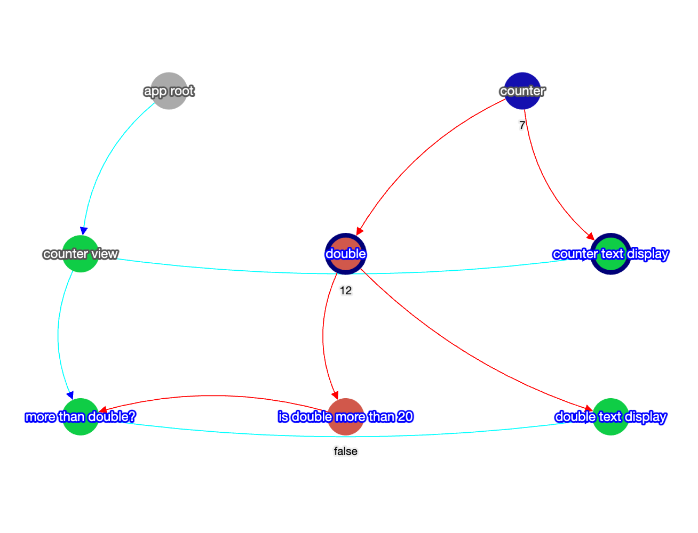

# Nano Signals

I made Nano Signals originally to [explain in simpler terms how Svelte 5 works under the hood](https://youtu.be/-SM77ksjpJI). But you might find this
useful in some circumstances anyway as a tiny reactive framework when you want to stay really light but need a little
bit of reactivity, but you don't want to deploy an entire framework.

Nano Signals is a lightweight TypeScript library designed for efficient and reactive state management. It enables
fine-grained reactivity through sources, effects, and derived values.

## Features

- **Reactive Effects**: Define reactive effects that automatically update when their dependencies change.
- **Effect Contexts**: Manage $effect contexts to control the lifecycle and reactivity scope.
- **Sources and Derived Values**: Utilize sources for state management and derived values to compute reactive data.

## Fancy Dependency Viewer



One of the main advantages of this framework as an educational tool is that it allows you to see a live graph of
effects, sources, and deriveds in action. You can see how they are marked dirty, step by step, and processed.
In order to do this, clone this repository, install the dependencies:

```bash
git clone https://github.com/petermakeswebsites/nano-signals
cd nano-signals
pnpm install
```

Then, simply modify the `src/main.ts` file to your liking, and run:

```bash
pnpm run dev
```

You can also set `Inspector.forceNames` to try to force you to set names to your sources, deriveds, effects,
and components. This will allow you to identify the signals in the dependency viewer. You can names like this:

```typescript
import {$source, $derived, $effect, $get} from 'nano-signals';

const count = $source(0, "count")
const double = $derived(() => $get(count)*2, "double")
$effect(() => console.log($get(double)), "print double")
```

_**Note**: this naming is disabled in production as the `Inspector` and naming functionality is stripped away
before packaging  for npm. The only way to access the `Inspector`, debugging, and naming is to use it through this
repo directly.

## Installation

Install Nano Signals from using npm / pnpm:

```bash
npm install nano-signals

// -or-

pnpm install nano-signals
```

Or using yarn:

```bash
yarn add nano-signals
```

## Usage

### Initialising

Your app needs to be wrapped in an `$effect.root` in order for the `$effect`.

```typescript
import {$effect} from 'nano-signals';

const app = $effect.root(() => {
    /* all effects created synchronously will be attached to this root */
})

// Destroy all $effects in app effect root
app.destroy()
```

### Creating Effects

Define an `$effect` that reacts to changes in dependencies:

```typescript
import {$source, $effect, $get, $set} from 'nano-signals';

// ...
const count = $source(0)

$effect(() => {
    console.log(`The new value is ${$get(mySource)}`)
    return () => console.log("Effect is being cleaned up!")
})

// ...
// Later in the code
// ...

$set(count, $get(count) + 1)
```

### Working with Derived Values

Create derived values that automatically update based on other reactive sources:

```typescript
import {$derived, $get} from 'nano-signals';

const count = $source(5);
const double = $derived(() => $get(count) * 2);
```

### HTML helper functions

There are various helper functions for working with the DOM. In general, helper functions that start with `$`
return a function that's the opposite of what they do, and therefore can be passed to an `$effect` and take
the cleanup function into account automatically

```typescript
import {$children, $get, html, create, $bind, $window} from 'nano-signals';

// ... within root node
const parentNode = document.querySelector('#parentNode')

// Parse html string and return a selector shortcut. `html` also has
// all the properties of the body element that contains the elements. 
const {$, $all} = html(`<div><span>hello</span><span>world</span></div>`)
const div = $('div')
const [span1, span2] = $all('span')

// $child and $children return a function that removes the element
// from the parent element
$effect(() => $child(parentNode, div))
// or
$effect(() => $children(parentNode, span1, span2))

// ---

const input = create('input')

// Sets up two-way binding with defaults set up for input. See type
// definitions for more extensibility
$bind(someSource, input)

// Listen to window events and automatically remove them when
// the $effect is destroyed
$effect(() => $window.listen("resize", () => console.log("resizing!")))
//
```

### Component

Components can be created quite easily. There are simply an `$effect.pre` wrapper with props that can be passed down.

```typescript
export const Focus = $component((node) => {
    const input = create('input')
    const name = $source('sally')
    $bind(input, name)
    $effect.pre(() => $child(node, input))
})
```

## API Reference

Refer to the type definitions within the library for detailed API information.

## Contributing

Contributions are welcome! Please open an issue or submit a pull request if you have suggestions or improvements.

## License

Nano Signals is [MIT licensed](./LICENSE).
